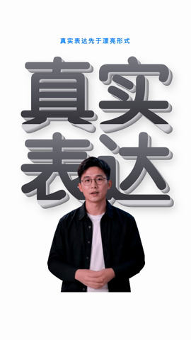
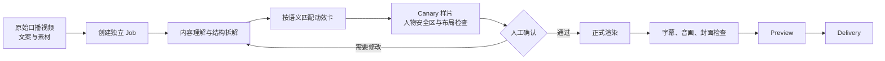

# hd-talking-head

面向中文口播视频的完整后期制作 Skill：从原始口播、文案和用户素材开始，完成内容理解、封面、A-roll 清理、B-roll、字幕、样片、预览和交付。

它不是一个独立的视频剪辑软件，而是一套带人工确认门、文件哈希和 Job 状态管理的生产流程。实际渲染仍需要兼容的项目运行时、FFmpeg/FFprobe，以及当前 Job 已确认的外部服务。

## 先看效果：新版 TalkCraft 竖屏成片

README 主展示区现在只使用已渲染的 `1080 × 1920 @ 24fps` 竖屏样片，不再使用上游 gallery 的横屏缩略图。下面的抽帧来自实际视频，能看到人物、标题、素材和界面在竖屏画布中的真实布局。

<table>
  <tr>
    <td></td>
    <td></td>
    <td></td>
    <td></td>
  </tr>
  <tr>
    <td align="center">立体标题与人物让位</td>
    <td align="center">素材墙聚焦主体</td>
    <td align="center">品牌标识入场</td>
    <td align="center">人物 + 标注信息</td>
  </tr>
</table>

可直接播放的竖屏视频：

- [Behind Text Title｜竖屏视频](assets/talkcraft-portrait-samples/behind-text-title-portrait.mp4)
- [Grid to Hero｜竖屏视频](assets/talkcraft-portrait-samples/grid-to-hero-portrait.mp4)
- [Logo Enter｜竖屏视频](assets/talkcraft-portrait-samples/logo-enter-portrait.mp4)
- [Scanline Annotate｜竖屏视频](assets/talkcraft-portrait-samples/scanline-annotate-portrait.mp4)

这些视频是真正的竖屏渲染结果，不是把横屏素材裁切后伪装成竖屏。样片说明见 [`assets/talkcraft-portrait-samples/SOURCE.md`](assets/talkcraft-portrait-samples/SOURCE.md)。

## 它能完成什么

- 以独立 Job 管理每条视频，避免不同视频的素材、配置和批准记录互相污染。
- 固定 `full-v2` 十二阶段流程：
  `inspect → content_analysis → cover_direction → cover → speech_cleanup → edit_structure → visual_direction → visual_canary → visual_assets → subtitles → preview → delivery`
- 支持原生 9:16 视觉工作流、A-roll、B-roll、字幕、头像安全区和音画同步检查。
- 内置 TalkCraft 108 张动效卡：根据口播语义自动匹配，绑定当前 Job 的 brief，经过 canary 和人工确认后才进入正式执行。
- 支持本地 canonical、第三方模板、SemanticState、RelationMotion 等已登记视觉能力。
- 所有正式模板、素材、运行时和发布包均使用 SHA-256 身份绑定，发现漂移时自动停止。
- 可选 Fish Audio 配音；默认仍优先使用用户提供的成品配音，不会自动发起付费调用。

## 工作流总览



## 安装

推荐将整个仓库安装到 Agent 的 Skill 目录，不要只复制 `SKILL.md`：

```bash
git clone https://github.com/fjhongdong/hd-talking-head.git \
  ~/.agents/skills/hd-talking-head
```

安装后验证发布包：

```bash
python3 ~/.agents/skills/hd-talking-head/scripts/verify_skill_release.py
```

验证器会检查发布清单、文件完整性和全部 SHA-256。失败时不要手工刷新清单掩盖差异。

## 用法：从素材到成片

### 1. 准备输入

至少准备：

- 一条原始口播视频（推荐含清晰人声和稳定人物画面）。
- 一份对应文案（Markdown、TXT 均可）。
- 可选的品牌字体、Logo、产品截图、B-roll 和人物透明素材。

### 2. 创建 Job

```bash
python3 ~/.agents/skills/hd-talking-head/scripts/initialize_video_job.py \
  --project-root /path/to/project \
  --jobs-root /path/to/project/video-jobs \
  --title "本期标题" \
  --video /absolute/path/input.mp4 \
  --script /absolute/path/script.md
```

### 3. 运行依赖预检

先确认项目运行时、FFmpeg/FFprobe、字体、人物素材和 TalkCraft 注册表可用，再进入视觉阶段。TalkCraft 项目可额外运行：

```bash
python3 /path/to/project/edit/hd/integrations/talkcraft/check_runtime.py
```

### 4. 生成并审核样片

先执行 `visual_direction` 和 `visual_canary`，确认以下内容后再正式渲染：

- 人物没有被标题、字幕或动效遮住。
- 竖屏构图不再沿用横屏左右分栏，主体和信息有明确层级。
- 字体、行距、描边、渐变和动效符合当前品牌视觉。
- 语义匹配正确，画面确实表达了这段口播，而不是套一个通用外壳。

### 5. 预览与交付

正式渲染后进入 `subtitles → preview → delivery`。最终交付前检查视频、字幕、音频、封面和 Job 审计记录是否齐全。

## 最终会得到什么

一个完整 Job 通常包含：

```text
video-jobs/<job-id>/
├── input/              原始视频、文案和用户素材
├── analysis/           内容分析、口播结构和视觉方向
├── visual/             动效卡匹配、brief、canary 和审核记录
├── render/             中间渲染、字幕和最终视频
├── preview/            可审阅样片与问题记录
└── delivery/           最终视频、封面、字幕和交付清单
```

最终效果不是“把文字贴到人物旁边”，而是：人物负责建立信任，字幕负责可读性，动效卡负责把抽象概念变成时间、层级、关系、反馈和变化；所有元素都根据口播时间轴进入和退出。

## TalkCraft 集成

TalkCraft 不使用旧的通用模板注册表，而使用项目内独立注册表：

- `edit/hd/tools/talkcraft_matcher.py`：按口播语义、目标角色、可用媒体和人物需求匹配卡片。
- `edit/hd/integrations/talkcraft/runtime/card-registry.json`：正式资格和运行时准入的唯一来源。
- `edit/hd/integrations/talkcraft/runtime/card-semantic-index.json`：只用于稳定检索，不替代正式准入。
- `edit/hd/integrations/talkcraft/check_runtime.py`：检查生产运行时、上游基线、工作台和可选配音入口。
- `edit/hd/tools/talkcraft_workbench.py`：生成工作台编辑合同，并把文字/主题调参写成新的待审核 draft bundle。

生产运行时和上游 Workbench 的依赖必须隔离。工作台修改不会覆盖已批准产物，必须重新经过 canary 和人工审核。

## 目录结构

```text
SKILL.md                 主执行合同
references/              阶段、依赖、模板和发布参考
scripts/                 Job 初始化、预检、渲染适配和审计脚本
assets/                  已登记模板、样片和验证证据
tests/                   Skill 合同与适配器测试
release-manifest.json    发布文件及 SHA-256 清单
```

## 安全边界

- 不把 API Key、Token、用户素材或 Job 文件提交到 Skill 仓库。
- 不自动替换已批准的模型、字体、素材、模板或运行时。
- 外部生成和付费配音必须经过当前 Job 的配置确认。
- 历史样片只是资格证据，不代表当前视频已经生成或验收。
- 本仓库未声明统一开源许可证；上游素材、样片和第三方资源请按各自文件中的许可和来源说明使用。

## 当前仓库

公开地址：[github.com/fjhongdong/hd-talking-head](https://github.com/fjhongdong/hd-talking-head)
